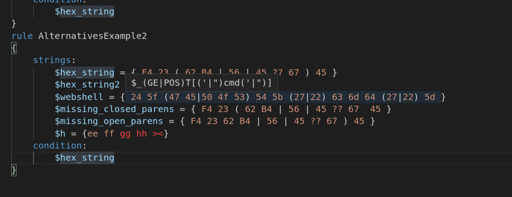

# YARA for Visual Studio Code
Language support for the YARA pattern matching language

## Screenshot


## Features

### Definition Provider and Peeking
Allows peeking and Ctrl+clicking to jump to a rule definition. This applies to both rule names and variables


### Reference Provider
Shows the locations of a given symbol (rule name, variable, constant, etc.)


### Code Completion
Provides completion suggestions for standard YARA modules, including `pe`, `elf`, `math`, and all the others available in the official documentation: https://yara.readthedocs.io/en/latest/modules.html


### View Hex Strings as ASCII
When hovering over a hex string, this feature converts the hex into ASCII characters and displays it just over the text. Wildcards and special characters are preserved in the conversion.



#### Looking to add or modify a module?
All modules are stored as JSON under `yara/src/modules/`. Each module has its own file corresponding to the module name, and the JSON entries are key/value pairs where the key is the module entry, and the type of entry it is. Entry types are any of the following:

* **Property**: A simple string or integer value, such as `pe.number_of_sections`
* **Method**: A function to be called, such as `pe.is_dll()`
* **Enum**: A constant value with a specific name, such as `pe.DLL`
* **Dictionary**: A struct of properties accessed via string keys, such as `pe.version_info["FileVersion"]`
* **Array**: A zero-based array of values, usually strings or structs, such as `pe.sections[]`
* **Sub-field**: A struct located inside an array containing properties unique to each array entry, such as `pe.sections[].name`

### Snippets
Some snippets have been included for basic YARA rule patterns, such as `any/all of them`, `for..of`, and common binary file headers.

Additionally, each section in a rule (`meta`, `strings`, `condition`) has a toggle-able snippet that can be controlled by the YARA configuration built in to VSCode. If my section snippets interfere with existing ones you've set up, just turn them off!

Lastly, the built-in `meta` snippet has its own configuration entry, so you can pre-generate your metadata for every rule. It supports snippet variables, such as `${CURRENT_DATE}` or `${TM_FILENAME}` as well. For example, setting the `yara.metaEntries` configuration to the following will auto-fill the date, and a tabstop will be placed in the hash field for you to fill in immediately:

```
{
    "date": "${CURRENT_YEAR}-${CURRENT_MONTH}-${CURRENT_DATE}",
    "hash": ""
}
```

Wanting to add your own snippet or curious what snippet variables exist? Take a look at https://code.visualstudio.com/docs/editor/userdefinedsnippets#_create-your-own-snippets

## Problems?
If you encounter an issue with the syntax, feel free to create an issue or pull request!
Alternatively, check out some of the YARA syntaxes for Sublime and Atom, or the one bundled with YARA itself.
They use the same syntax engine as VSCode and should work the same way.

## YARA Documentation
https://yara.readthedocs.io/
